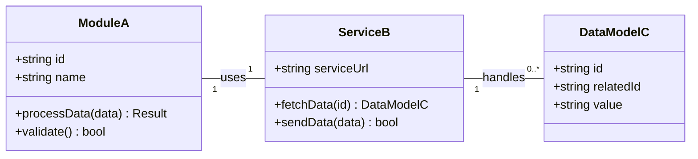

# Диаграмма: [Название Задачи]

_**Цель этого документа:** Предоставить визуальное представление архитектуры, потока данных или взаимосвязей сущностей, затронутых в рамках данной задачи. Мы используем синтаксис **Mermaid.js** для создания "Диаграмм как Код"._

_**Инструкция:** Опишите, что изображено на диаграмме ниже. Затем вставьте или измените код в блоке `mermaid`._

---

## Описание Диаграммы

Эта диаграмма классов (UML Class Diagram) показывает основные модули и модели данных, которые были созданы или изменены в рамках задачи: `ModuleA`, `ServiceB`, `DataModelC`. Она также иллюстрирует их ключевые атрибуты, методы и взаимосвязи.

